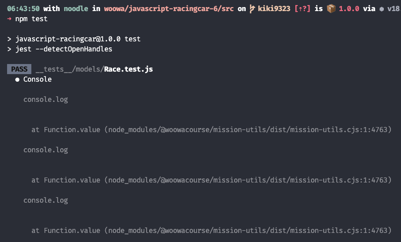
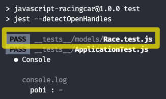

# 함수 모킹과 모킹된 함수의 구현 재정의

함수 모킹 : `jest.spyOn()` 과 `jest.fn()`  
모킹된 함수 구현 재정의 : `mockImplementation()`

## 1. 상황

메서드가 몇 번 호출 되었는지 확인 하기 위해 테스트 코드를 작성하던 도중,  
`console.log` 기능이 있는 함수 때문에 디버깅 화면이 지저분해져서 이를 막기 위한 해결 과정

### 1.1 수정 전 테스트 코드

```js
// Race.test.js

...
test('startRace 메서드가 attempts 만큼 반복 시도 되었는지 확인', () => {
  const moveCarsSpy = jest.spyOn(race, 'moveCars');

  // 단순히 스파이만 했어서 아래 PrinterView.print()가 실행되었음.
  const printRaceStatusSpy = jest.spyOn(race, 'printRaceStatus');

  race.startRace();

  expect(moveCarsSpy).toHaveBeenCalledTimes(race.attempts);
  expect(printRaceStatusSpy).toHaveBeenCalledTimes(race.attempts);
});
...
```

```js
// Race.js
...
printRaceStatus() {
  for (const car of this.cars) {
    const name = car.name;
    const currentPosition = car.getPosition();
    const dash = '-'.repeat(currentPosition);

    // 얘가 자꾸 터미널에 보였다.
    PrinterView.print(`${name} : ${dash}`);
  }
}
...
```

### 1.2 수정 후 테스트 코드

`jest.spyOn()` 를 바로 사용하는 대신 문제가 되는 메서드, 즉 모킹된 함수를 재정의한다.
재정의는 `mockImplementation(() => {원하는 동작을 수행하는 콜백})` 메서드로 한다.

아래 코드는 console.log 호출을 방지한다.

```js
// Race.test.js

...
test('startRace 메서드가 attempts 만큼 반복 시도 되었는지 확인', () => {
  const moveCarsSpy = jest.spyOn(race, 'moveCars');
  const printRaceStatusSpy = jest.spyOn(race, 'printRaceStatus');

  // PrinterView.print 메서드를 모킹하여 console.log 호출을 방지
  jest.spyOn(PrinterView, 'print').mockImplementation(() => {});
  // 혹은 jest.fn()을 사용해도 된다.
  // jest.spyOn(PrinterView, 'print').mockImplementation(jest.fn());

  race.startRace();

  expect(moveCarsSpy).toHaveBeenCalledTimes(race.attempts);
  expect(printRaceStatusMock).toHaveBeenCalledTimes(race.attempts);
});
...
```

### 1.3 실행 결과

> console.log가 3번 출력되고 있다.
> 

<br />

> `mockImplementation()` 으로 재정의 후 console.log 없이 테스트 완료.
> 

<br />
<br />
<br />

## 2. 정리

#### `jest.spyOn()`

```js
const obj = {
  method() {
    // 원래의 동작
  },
};

const spy = jest.spyOn(obj, "method"); // 메서드를 스파이로 감싸기

obj.method(); // 스파이된 메서드 호출

expect(spy).toHaveBeenCalled(); // 스파이된 메서드가 호출되었는지 확인
```

- 기존 객체의 메서드를 스파이 기능으로 감싼다.
- 이를 통해 메서드가 호출되었을 때 **원래의 동작을 유지**하면서 **추가적인 동작을 수행**한다.
- 메서드의 호출 여부, 호출 횟수, 전달된 인자 등을 사용할 수 있다.
- 추가적인 동작을 수행하는데에 사용한다.

#### `jest.fn()`

```js
const mockFunction = jest.fn(); // 가짜 함수 생성

mockFunction(); // 가짜 함수 호출

expect(mockFunction).toHaveBeenCalled(); // 가짜 함수가 호출되었는지 확인
```

- 단순히 **가짜 함수를 생성**하는 기능
- **원하는 동작을 수행하도록 설정할 수 있다.**
- 메서드의 호출 여부, **반환 값 모킹** 등으로 사용한다.

#### `mockFn.mockImplementation(fn)`

- 모킹된 함수의 동작을 원하는 대로 바꿀 수 있다.
- 원하는 시나리오에 맞게 특정한 동작을 수행하도록 설정할 수 있음.

```js
jest.fn(implementation)  // is a shorthand for
jest.fn().mockImplementation(implementation).
```

```js
// 모킹된 함수 생성
const mockedFn = jset.fn();

// 모킹된 함수의 동작을 재정의한다.
mockedFn.mockImplementation(() => {
  // 원하는 동작 재정의
});
```

##### class 에서도 사용가능하다.

```js
// SomeClass.js
module.exports = class SomeClass {
  someMethod(a, b) {
    return a + b;
  }
};
```

```js
// SomeClass.test.js
const SomeClass = require("./SomeClass");

// 자동 생성되는 automocking = 해당 모듈의 모든 함수와 객체가 자동으로 모킹
jest.mock("./SomeClass");

const mockedMethod = jest.fn();
SomeClass.mockImplementation(() => {
  return {
    method: mockedMethod,
  };
});

const some = new SomeClass();
some.method("a", "b");

console.log("Calls to method: ", mockMethod.mock.calls);
```
